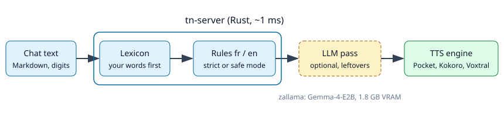

# tn-rs — portfolio

**Text a speech engine can read: numbers, dates, amounts and chat Markdown turned into words, in about a millisecond.**

- **Goal**: every TTS engine reads "9h30", "1 250 000 €", "21/10/2026" and a
  Markdown list the way a person would, with the user's own pronunciations
  for new words.
- **Target users**: zallama administrators, developers voicing LLM answers,
  maintainers of pronunciation lists.
- **Context**: Ze Family building block; runs as a zallama backend in front
  of Pocket TTS, Kokoro and Voxtral, optionally followed by a small LLM pass.

Demo — the same French sentence read by Pocket TTS without and with tn
(*« La réunion commence à 9h30 et le budget atteint 1 250 000 €. Appelez Mme
Dupont au 06 12 34 56 78 avant le 21/10/2026. »*):
[demo-before.wav](demo-before.wav) (Parakeet hears « commence à Anna Pritz,
so and the budget attain a PAP apple… ») ·
[demo-after.wav](demo-after.wav) (heard exactly).

## Before / after (real output of `tn-server normalize`)

| Input | Output |
|---|---|
| `La réunion commence à 9h30 et le budget atteint 1 250 000 €.` | La réunion commence à neuf heures trente et le budget atteint un million deux cent cinquante mille euros. |
| `Le 1er mai, il fera entre 18 et 24 °C, soit 3,5 % de plus.` | Le premier mai, il fera entre dix-huit et vingt-quatre degrés, soit trois virgule cinq pour cent de plus. |
| `Appelez le 06 12 34 56 78 avant le 21/10/2026, Mme Dupont.` | Appelez le zéro six douze trente-quatre cinquante-six soixante-dix-huit avant le vingt et un octobre deux mille vingt-six, Madame Dupont. |
| `Meet at 9:30 am, it costs $5.50 and rose 12% in 1984.` | Meet at nine thirty a m, it costs five dollars and fifty cents and rose twelve percent in nineteen eighty-four. |
| `## Semaine` / `- **Livraison** jeudi 🚚` | Semaine. Livraison jeudi. |

Heard through Pocket TTS and transcribed by Parakeet, a 2 400-character chat
answer went from half unintelligible (every number garbled) to fully correct.

## Usage scenarios

1. **Voice assistant**: zallama receives an LLM answer for
   `/v1/audio/speech`, calls `tn-server`, and the TTS engine reads clean
   sentences.
2. **New product names**: add `fr<TAB>Nvidia<TAB>ène vidia` to the lexicon;
   the next request uses it, no restart.
3. **Batch narration**: `tn-server normalize --lang fr < chapter.md | pocket-tts generate …`.

## Architecture

Rust · regex rules per language · axum HTTP API · TSV lexicon reloaded on
change. Optional LLM pass for context-dependent readings
([../docs/llm-pass.md](../docs/llm-pass.md)).

## Metrics

| | |
|---|---|
| Speed | 9.5 ms for 25 568 characters, process start included |
| Quality (16 reference sentences) | rules 6.0 % WER; safe rules + Gemma-4-E2B 1.0 % WER, 0 dropped words |
| Footprint | one ~3 MB binary, no model, no GPU |
| Tests | 22 unit and API tests, end-to-end script |

## Links

- Source: https://github.com/rzafiamy/tn-rs
- Issues: https://github.com/rzafiamy/tn-rs/issues
- Used by: https://github.com/rzafiamy/zallama, https://github.com/rzafiamy/pocket-tts-rs
